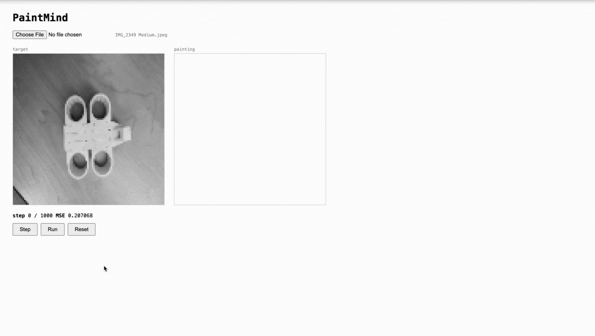

# PaintMind

An optimization-based AI agent that reconstructs images step-by-step using circles and rectangles. After each run, it records where it failed and uses that signal to guide sampling in the next run — converging faster over time without any learned parameters.

---

## 🚀 Demo



> Run the same image twice — the second run typically converges faster.

---

## Core Idea

PaintMind frames image reconstruction as a **search and optimization problem**.

At each step, the agent:
1. Samples candidate drawing primitives (circles and rectangles)
2. Evaluates each candidate by how much it reduces the objective function
3. Commits the best one to the canvas

The objective function is normalized pixel-wise **Mean Squared Error**:

```
MSE = (1/N) × Σ (target[i] − current[i])²  ,  normalized to [0, 1] by dividing by 255²
```

There are no neural networks, no training data, and no pre-trained weights. Every stroke is chosen by direct evaluation against the target image.

---

## How It Works

### Per-Step Loop

1. **Snapshot** the current canvas state
2. **Build an error map** — compute `|target - current|` per pixel
3. **Sample candidate positions** — bias toward high-error regions using a CDF over the error map
4. **Evaluate primitives** — for each candidate position, try both a circle and a rectangle with analytically optimal color
5. **Select** whichever primitive reduces MSE the most
6. **Apply** it to the canvas

### Analytical Color Selection

Rather than searching over color values, the optimal grayscale fill is derived in closed form:

```
gray = (target_mean − current_mean × (1 − α)) / α
```

where `α` is the opacity of the primitive and means are taken over pixels inside the shape. This eliminates one dimension of search entirely.

### Multi-Scale Drawing

Primitive size decays quadratically with progress through the run:

```
maxExtent = max(1, round((large - 1) × (1 - progress)² + 1))
```

Early steps use large shapes to establish rough structure. Later steps use small shapes to refine detail.

---

## Learning Across Runs

After each run, PaintMind captures a **residual error heatmap** — the pixel-wise difference between the final painting and the target. On the next run, this map is blended into the sampling weights:

```
weight[i] = |target[i] - current[i]| + prior[i] × 0.5
```

Pixels that were hard to reconstruct last time receive higher sampling probability next time. This is a lightweight, non-parametric form of cross-run memory — no learned parameters, no gradient updates.

---

## Results

Three consecutive runs on the same 96×96 grayscale image (1000-step budget, MSE threshold 0.001):

| Run | Steps to completion | Final MSE |
|-----|---------------------|-----------|
| 1   | 480                 | 0.000924  |
| 2   | 421                 | 0.000998  |
| 3   | 427                 | 0.000996  |

Run 2 converged ~12% faster than Run 1. Final MSE fluctuated slightly across runs — Run 2 and 3 were marginally worse than Run 1 despite converging sooner.

This reflects a real tradeoff: the heatmap bias can accelerate convergence but also nudge the agent toward different local minima, where final quality may vary.

---

## Why Results Vary Across Runs

PaintMind uses **stochastic search** — candidate positions are sampled randomly, weighted by error. This means two runs on the same image will follow different paths and can end at different local minima.

A few specific factors:

- **Greedy selection** — the agent commits the best single primitive at each step, with no backtracking. An early choice that looks good locally can make later steps harder.
- **Stochastic sampling** — even with heatmap biasing, the agent samples randomly within the weighted distribution. High-probability regions are visited more often, not exclusively.
- **Heatmap bias is approximate** — the prior reflects where the *previous* run struggled, not necessarily where *this* run will struggle. Different stochastic paths produce different residual patterns.
- **No global optimization** — there is no mechanism to escape a local minimum once the agent is in one. Final MSE reflects where the greedy path happened to land.

In practice: convergence speed tends to improve modestly across runs; final MSE may improve, stay flat, or slightly regress.

---

## Visualization

### MSE Curve

A live SVG line chart plots MSE vs step during each run. The previous run's curve is overlaid in gray for comparison. The characteristic shape — steep initial drop, long shallow tail — reflects the multi-scale drawing schedule.

### Run Comparison

After the second run, a comparison block shows:
- Steps to convergence: previous vs current
- Final MSE: previous vs current
- Delta for each metric

The comparison baseline is locked at Reset time and does not update until the next reset, so it remains a stable reference throughout the current run.

---

## Tech Stack

| Layer | Choice |
|---|---|
| Frontend | React 18 + TypeScript |
| Build | Vite |
| Canvas | HTML5 Canvas API (offscreen environment) |
| Agent | Pure TypeScript — no ML framework |
| Scoring | Custom normalized MSE |
| Visualization | Native SVG (no chart library) |
| Tests | Vitest |
| Backend | None |

---

## Why This Project Matters

PaintMind is a study in building AI systems that are **interpretable by construction**. Every decision the agent makes is a single primitive chosen by direct MSE comparison — no black box, no embeddings, no latent space.

A few things this project demonstrates practically:

- **Search-based optimization** is a viable alternative to learning-based approaches for constrained generation tasks
- **Analytical solutions** (closed-form color selection) can replace search dimensions entirely, improving efficiency without sacrificing quality
- **Simple memory mechanisms** (the heatmap) can meaningfully shape future behavior without any learned parameters
- **Architecture boundaries matter** — the agent is a single swappable function; replacing it with a learned policy or an LLM-guided agent requires no changes to the environment or UI

---

## Key Insights

- **Analytical color selection** eliminates one search dimension, making candidate evaluation cheap enough to run 50 candidates per step in real time
- **Error-biased CDF sampling** outperforms uniform random sampling — focusing candidates on high-error regions accelerates early convergence
- **Evaluating both primitives per position** lets the agent adapt to image structure without explicit shape detection
- **The MSE tail is the hard part** — fine detail requires many small, precisely placed primitives and benefits most from heatmap-guided sampling
- **Greedy + stochastic = fast but imperfect** — the agent is not globally optimal; it is fast and observable, which matters for interactive use

---

## Future Improvements

- **Color support** — extend from grayscale to RGB with per-channel optimal color
- **Rotated rectangles and triangles** — broaden the primitive vocabulary for angled edges
- **Plateau detection** — automatically expand search radius when MSE improvement stalls
- **Learned policy** — replace random search with a small network trained to predict high-value placements
- **Parallel candidate evaluation** — web workers for faster per-step search
- **Export** — save the primitive sequence as SVG or replay as animation

---

## Getting Started

**Requirements:** Node.js 18+

```bash
# Install dependencies
npm install

# Start dev server
npm run dev

# Run tests
npm test
```

Open `http://localhost:5173`, upload an image, and click **Run**.

---

## Author

**Matthew Kim**
[matthewminchulkim@gmail.com](mailto:matthewminchulkim@gmail.com) · [GitHub](https://github.com/matthewkim)
